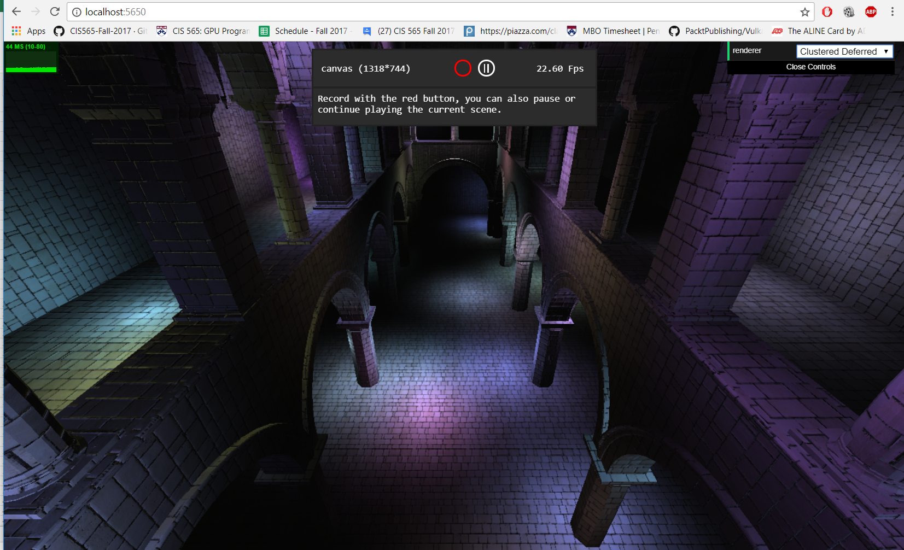
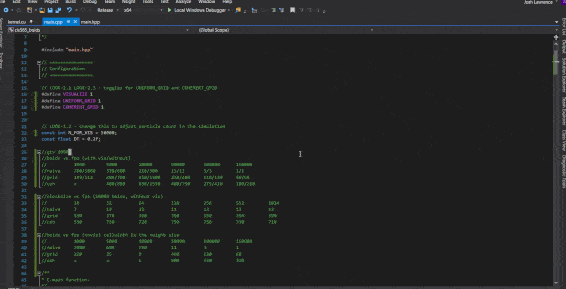

# RepositoryListing
**Table of Contents**
* [Graphics Self Study](https://github.com/loshjawrence/GraphicsSelfStudy) 
* [Cloth Simulation](https://github.com/loshjawrence/ClothSim) 
* [Fluid Simulation](https://github.com/loshjawrence/FluidSim) 
* [Vulkan VR Simulator](https://github.com/loshjawrence/SecondaryVR) 
* [CUDA Path Tracer](https://github.com/loshjawrence/Project3-CUDA-Path-Tracer) 
* [WebGL Clustered Deferred and Clustered Forward Plus Renderer](https://github.com/loshjawrence/Project5-WebGL-Clustered-Deferred-Forward-Plus) 
* [Physically-Based Renderer](https://github.com/loshjawrence/Physically-Based-Rendering) 
* [CUDA Rasterizer](https://github.com/loshjawrence/Project4-CUDA-Rasterizer) 
* [Style Transfer](https://github.com/loshjawrence/AnimationStylizer) 
* [Mini-Minecraft](https://github.com/loshjawrence/Mini-Minecraft) 
* [Half-Edge Mesh Representation and Catmul-Clark Subdivision](https://github.com/loshjawrence/HalfEdgeCatmulClarkSubdivision) 
* [Animation Projects](https://github.com/loshjawrence/AnimationProjects) 
* [CUDA Boids Flocking](https://github.com/loshjawrence/Project1-CUDA-Flocking) 
* [CUDA Recursive Stream Compaction, Radix Sort](https://github.com/loshjawrence/Project2-Stream-Compaction) 

# [Graphics Self Study](https://github.com/loshjawrence/GraphicsSelfStudy) 
Where I learn, implement, and experiment with modern graphics techniques in OpenGL. 
**Cascaded Shadows,Shadow Mapping(PCF, VSM, ESM, EVSM),Horizon based SSAO, HDR, Tonemapping, Bloom, Color Grading, PBR ** 

# [Cloth Simulation](https://github.com/loshjawrence/ClothSim) 
Clothing simulation using Backward and Forward Euler integration. 
**Backward Euler (implicit)** 

**Forward Euler (explicit).** 

# [Fluid Simulation](https://github.com/loshjawrence/FluidSim) 
Fluid simulation using a Semi-Lagrangian approach with a MAC grid. 

# [Vulkan VR Simulator](https://github.com/loshjawrence/SecondaryVR) 
A scratch VR simulator written in vulkan. Radial density masking, Adaptive Quality, Timewarp simulation, perf comparison of several barrel distortion/chromatic aberration implementations, push constant comparison. 
**Timewarp Simulation. Rendering stops and warps the last frame rendered into the current view** 

**Radial Density Masking mentioned in Alex Vlacho's GDC 2016 talk on VR rendering. See repo for more information.** 

# [CUDA Path Tracer](https://github.com/loshjawrence/Project3-CUDA-Path-Tracer) 
A CUDA path tracer project done for CIS565 GPU Programming. It's a unidirectional path tracer with direct lighting MIS and a Jensen01 dipole model BSSRDF implementation. For work efficiency, it includes stream compaction to eliminate dead paths and material sorting to minimize thread divergence. 
**Diffuse vs Jensen01 bssrdf, marble** 

# [WebGL Clustered Deferred and Clustered Forward Plus Renderer](https://github.com/loshjawrence/Project5-WebGL-Clustered-Deferred-Forward-Plus) 
A WebGL renderer that includes clustered deferred, clustered forward plus, and forward techniques for comparison. This was a project in CIS565 GPU Programming. The view frustum is broken up into a 3D cluster grid and each cluster is populated with point lights in the scene that could potentally effect the lighting in that region. This reduces the lighting computation in the fragment shader. 
**Clustered Deferred** 

# [Physically Based Renderer](https://github.com/loshjawrence/Physically-Based-Rendering) 
A CPU path tracer done for CIS561 Physically Based Rendering (using Pharr, Humphreys, and Jakob's physcially based rendering book as guidance). Includes unidirectional path tracer with direct lighting MIS and a (bad)photon mapping renderer. Also includes BVH tree scene representation to reduce intersection test complexity and Kd tree to represent arbitrary meshes. 
**Unidirectional pathtracer with MIS, 'tangle cube' implicit surface** 

**Photon Mapping with texture mapped microfacet roughness, glass ball, plastic cube** 
* could use more photons to smooth out the specular spots

# [CUDA Rasterizer](https://github.com/loshjawrence/Project4-CUDA-Rasterizer) 
A software rasterizer done in CUDA for CIS565 GPU Programming. Includes perspective correct interpolation texturing and anti-aliasing.
Also did a software rasterizer (cpu) for CIS560 Intro to Computer Graphics, but this was a nice refresher. 

# [Style Transfer](https://github.com/loshjawrence/AnimationStylizer) 
A from-scratch SIGGRAPH paper implementation done for CIS660 Advanced Topics in Computer Graphics and Animation. This was a group project with Grace Xu. Other papers were implemented as well (Image Analogies, Patch Match) in order to implement this Pixar paper. 

# [Mini-Minecraft](https://github.com/loshjawrence/Mini-Minecraft) 
A mostly from-scratch group project done for CIS560 Intro to Computer Graphics. I did terrain rendering, weather, and caves. 
**View of Caves From Under the Terrain** 

# [Half-Edge Mesh Representation and Catmul-Clark Subdivision](https://github.com/loshjawrence/HalfEdgeCatmulClarkSubdivision) 
A project for CIS560 exploring half-edge mesh representation for mesh manipulation and Catmul-clark subdivision. 
**Face Triangulation, extrusion and catmul-clark subdivision** 

**Sharpness with Subdivision** 

# [AnimationProjects](https://github.com/loshjawrence/AnimationProjects) 
Various animation projects done for CIS562 Computer Animation. 

# [CUDA Boids Flocking](https://github.com/loshjawrence/Project1-CUDA-Flocking) 
A project done for CIS565 GPU Programming implementing boids flocking. 

# [Stream Compaction](https://github.com/loshjawrence/Project2-Stream-Compaction) 
A project done for CIS565 GPU Programming implementing exclusive scan (recursive scan for EC) and radix sort. 

